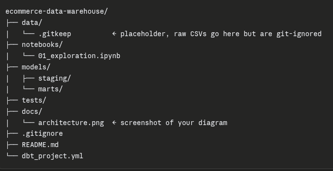

# E-commerce Data Warehouse

> End-to-end dbt pipeline on the Olist dataset — star schema, 
> DuckDB, automated tests, and a business analytics layer.

## Architecture


## Stack
- **Transform:** dbt-core + dbt-duckdb
- **Storage:** DuckDB (local), Kaggle (source data)
- **Testing:** dbt schema tests + custom singular tests
- **Docs:** dbt docs (auto-generated)

## Data model
- `fct_orders` — one row per order line item
- `dim_customers`, `dim_products`, `dim_dates` — conformed dimensions

## How to run
\```bash
pip install dbt-duckdb
dbt deps
dbt run
dbt test
\```

## Key insights
[fill this in once your dashboards are done]
